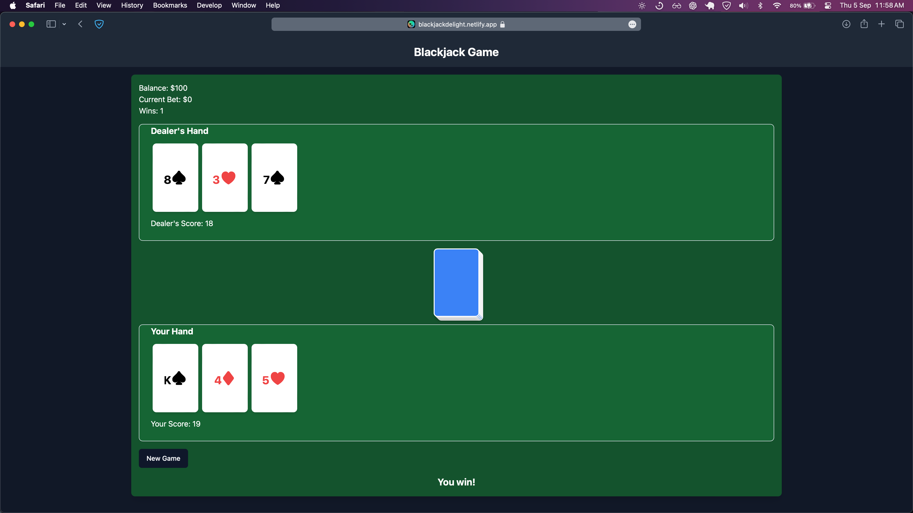
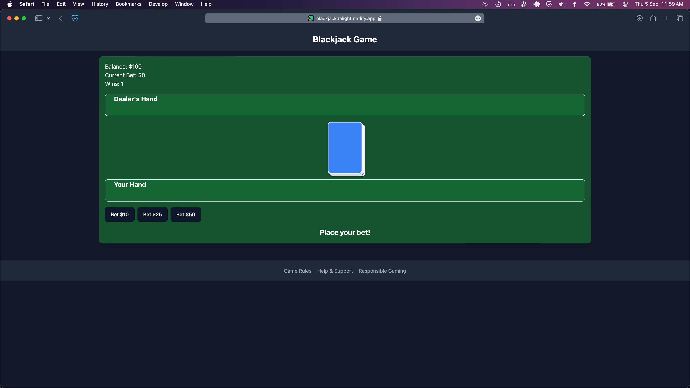
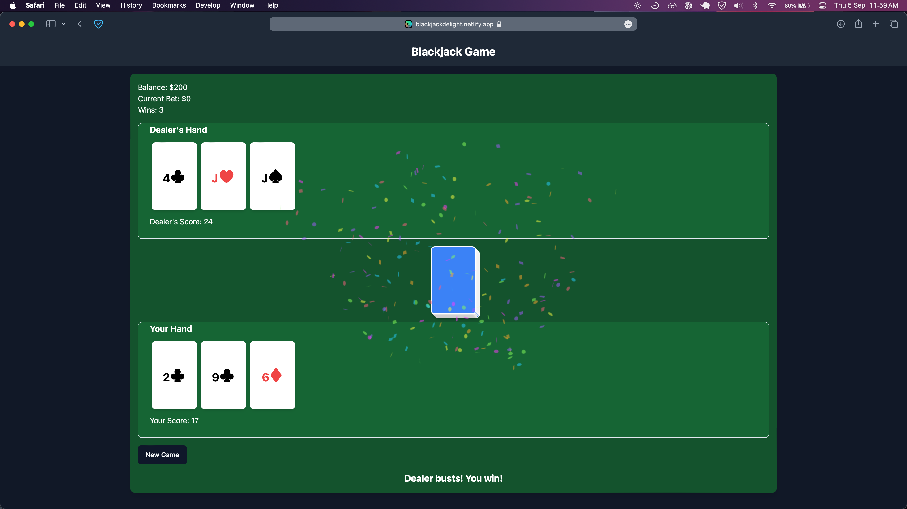

# 🃏 Blackjack Delight Dream

A sleek and interactive Blackjack game built with React and Tailwind CSS.

**URL**: https://blackjackdelight.netlify.app

## 🌟 Features

- **Realistic Gameplay**: Experience the thrill of Blackjack with authentic rules and gameplay.
- **Interactive UI**: Smooth animations and responsive design for an engaging user experience.
- **Balance Management**: Start with $50 and watch your balance grow (or shrink) as you play.
- **Win Tracker**: Keep track of your victories with a built-in win counter.
- **Dynamic Deck**: Visual representation of the remaining cards in the deck.
- **Dealer AI**: Intelligent dealer behavior following standard Blackjack rules.
- **Betting System**: Place bets before each hand to add excitement to every round.
- **Game Over Detection**: Automatic game over when your balance reaches zero.
- **Responsive Design**: Enjoy the game on various devices and screen sizes.

## 🎮 How to Use

1. Clone the repository to your local machine.
2. Install dependencies with `npm install`.
3. Run the development server with `npm run dev`.
4. Open your browser and navigate to `http://localhost:5173`.
5. Click "New Game" to start playing.
6. Place your bet and enjoy the game!
7. Hit or Stand based on your hand and the dealer's visible card.
8. Win by getting closer to 21 than the dealer without going over.

## 🛠️ Technologies Used

- React
- Tailwind CSS
- Framer Motion (for animations)
- Canvas Confetti (for win celebrations)
- Vite (for fast development and building)

## 📸 Screenshots

## 🤝 Contribution

Contributions are welcome! Please feel free to submit a Pull Request.

## 📄 License

This project is open source and available under the [MIT License](LICENSE).